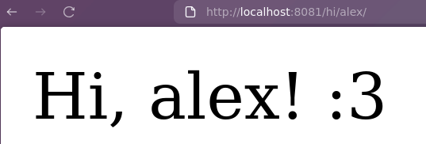

# ptt.h

## Description
ptt.h is a simple, easy-to-use HTTP library (currently under developement.

## Examples
A simple server that on GET requests to /example responds with a HTML page that displays a friendly message and a button :).

```c
#include "ptt.h"
#include <unistd.h>

ptth_response_t get_func(ptth_request_t _, ptth_shared_t *__) {
  PTTH_RESPONDE_HTML(
    "<!DOCTYPE html>"
    "<head></head>"
    "<body>"
    "HI! :)"
    "<button>CLICK ME!</button>"
    "</body>")
}

int main() {
  ptth_server_t server;
  ptth_init_server(&server);
  ptth_add_service(&server, PTTH_GET, "/example", &get_func);
  ptth_bind_server(&server, "127.0.0.1", 8081);
  ptth_start(server);
}
```
You're endpoints don't have to be static, you can retrieve name segments of your URL and retrieve them at run time. Here is an example where when you access /hi/<name>/ it will display the message "Hi, <name>! :3".
```c
#include "ptt.h"
#include <unistd.h>

ptth_response_t get_func(ptth_request_t req, ptth_shared_t *__) {
  char *test = ptth_map_get_value(*(req.mpath), "var_name");
  char message[100];
  message[0] = '\0';
  strcat(message, "Hi, ");
  strcat(message, test);
  strcat(message, "! :3");
  PTTH_RESPONDE_HTML(message)
}

int main() {
  ptth_server_t server;
  ptth_init_server(&server);
  ptth_add_service(&server, PTTH_GET, "/hi/{var_name}/", &get_func);
  ptth_bind_server(&server, "127.0.0.1", 8081);
  ptth_start(server);
}
```

